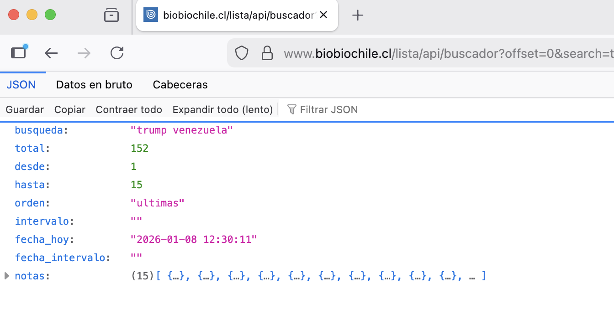
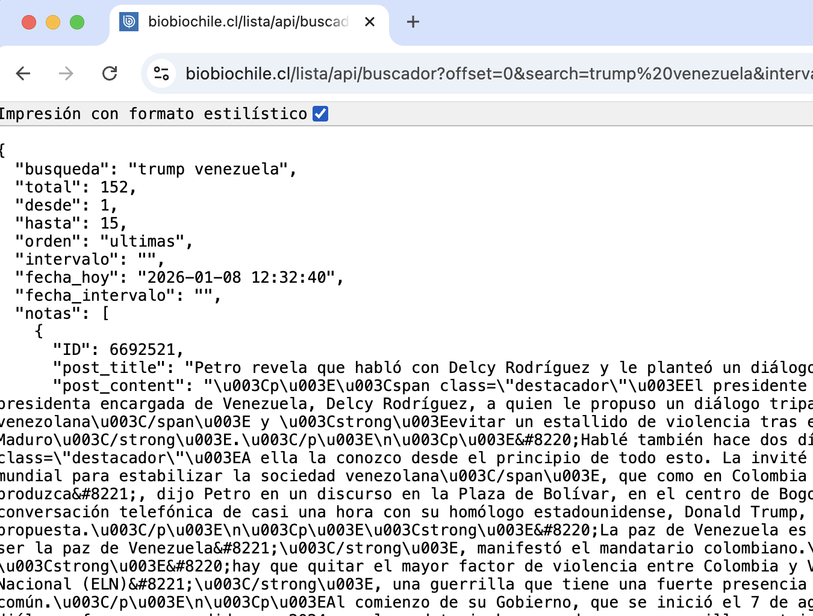

# EVMM 2026: Taller sobre extracción de datos
#### Docente: [Riva Quiroga](https://rivaquiroga.cl)

En este documento se encuentran los enlaces para acceder a los materiales que utilizaremos durante el taller. Vamos a trabajar con tu instalación local de R usando RStudio como entorno de desarrollo. También puedes crearte una cuenta en [Posit Cloud](https://posit.cloud/) si es que prefieres trabajar en la nube.

---

## Atajos de teclado útiles

Los siguientes atajos de teclado serán útiles al explorar las páginas web que _escrapearemos_.

| Acción | Windows / Linux | Mac |
|---|---|---|
| Ver el código fuente de una página | ctrl +  u | command + u|
| Abrir el panel de desarrollo | F12 ctrl + shift + i | F12 option + command +i |
| Abrir el panel de desarrollo con la opción de selección activada | ctrl + shift + c | option/ctrl + command + c |

## Enlaces ejemplos

A lo largo de la sesión revisaremos algunos sitios web a modo de ejemplo o para discutir algunas ideas. 

:link: [Sitio web estático](https://tramitacion.senado.cl/appsenado/index.php?mo=lobby&ac=GetReuniones&anho=2025)

:link: [Sitio web dinámico](https://www.camara.cl/transparencia/asesoriasexternasgral.aspx)

:link: [Condiciones de uso](https://www.amazon.com/-/es/gp/help/customer/display.html?nodeId=508088&ref_=footer_cou) 

:link: [Licenciamiento y uso del contenido 1](https://www.biobiochile.cl/)

:link: [Licenciamiento y uso del contenido 2](https://prensa.presidencia.cl/)

:link: [robots.txt 1](https://wikipedia.org/)

:link: [robots.txt 2](https://www.oas.org/)

## Actividades

Durante el taller realizaremos una serie de actividades para poner en práctica lo aprendido. Iremos escribiendo el código "en vivo", por lo que el contenido de los archivos con código se irá actualizando a medida que escribamos en ellos

### Ejemplo 1: extraer el texto de una página web

* 🌐 La página de la que extraeremos los datos: <https://prensa.presidencia.cl/discurso.aspx?id=308562>
* 📄 [El código que escribimos](https://www.dropbox.com/scl/fi/1r0kx1zjxcb90hpip1wua/01-web-scraping.R?rlkey=1iug18wjms4evafvmlvqw8271&dl=0)

### Ejemplo 2: interactuar con una API

* 🌐 La url con la que trabajaremos: <https://www.biobiochile.cl/lista/api/buscador?offset=0&search=trump+venezuela&intervalo=&orden=ultimas>
* 📄 [El código que escribimos](https://www.dropbox.com/scl/fi/m4nbhqwhwwq2vpec2dzuw/02-trabajo-con-apis.R?rlkey=673q624ug4di0bi5kduqzd4x3&dl=0)

Dependiendo del navegador que utilices, los resultados obtenidos con esa url se pueden visualizar un poco distinto. Así se ven en Firefox:

Y así se ven en otros navegadores:

## Recursos adicionales para seguir aprendiendo en el futuro

* [Programming Historian](https://programminghistorian.org/)
    * Hay un tutorial que cubre lo que vimos de web scraping durante la sesión: <https://programminghistorian.org/es/lecciones/introduccion-al-web-scraping-usando-r>
    
* [Analizar Datos Políticos](https://arcruz0.github.io/libroadp/) (Cruz & Urdinez, 2021)
* Participar en las actividades de las comunidades de R (LatinR, R-Ladies, etc.)

